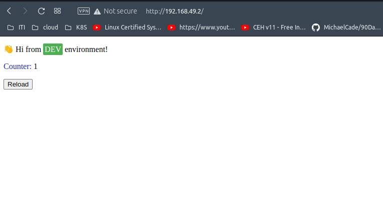
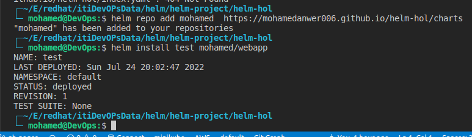

# Helm app

#### Start by containerize the application https://github.com/tradebyte/DevOps-Challenge

```
└─ mohamed@DevOps:$ docker push mohameddev006/web-app:v5

```

### Create helm chart

```
helm create web-app
```

### run chart on minikube

```
helm install webapp ./web-app
```


### Test the application



### Clean up

```
helm delete webapp
```

## index an deploy chart to github pages 

### package the chart

```
helm package . -d charts

```
### index

```
helm repo index charts
```

> push code to gh-pages branch to act as a repo for the chart

### Test
```
helm repo add mohamed  https://mohamedanwer006.github.io/helm-hol/charts

```
 

### Create metadata file to host on artifact.io