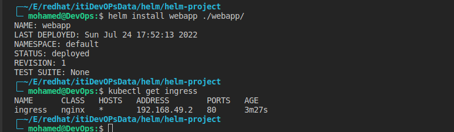

# Helm app

#### Start by containerize the application https://github.com/tradebyte/DevOps-Challenge

```
└─ mohamed@DevOps:$ docker push mohameddev006/web-app:v5

```

### Create helm chart

```
helm create web-app
```

### run chart on minikube

```
helm install webapp ./web-app
```



### Test the application


### Clean up

```
helm delete webapp
```

## index an deploy chart to github pages 

### index
 